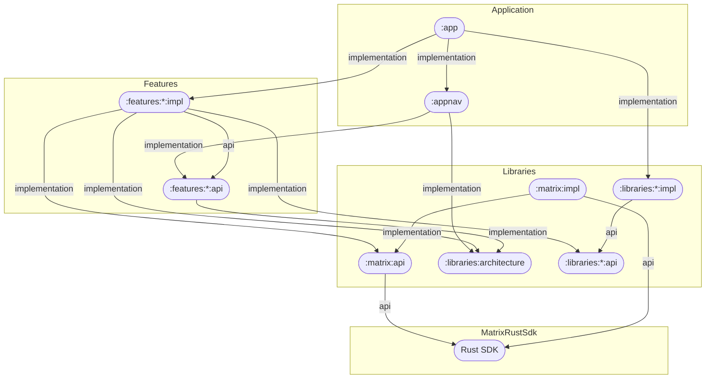

# 01 - 项目架构总览

> 本文件是架构层的详细参考。快速索引见根目录 `CLAUDE.md`，稳定锚点见 `.claude/memory/`。

## 一句话定位

Element X Android 是 **Element 的下一代 Matrix 客户端**（Android 7+，minSdk 24），采用**单体应用 + 多 Gradle 模块**结构。与上一代 Element Classic 相比是彻底重写：底层使用 **Matrix Rust SDK**（经 Uniffi FFI 桥接），UI 用 **Jetpack Compose**，导航用 **Appyx**，状态管理用 **Molecule + Compose runtime**。

## 分层架构

```
┌─────────────────────────────────────────────────────────┐
│  app (io.element.android.x)                             │
│    MainActivity ──► 持有并配置 RootFlowNode               │
└───────────────────────────┬─────────────────────────────┘
                            │ 导航接线（appnav）
┌───────────────────────────▼─────────────────────────────┐
│  appnav (io.element.android.appnav)                      │
│    RootFlowNode：根导航流，组合各 feature 的 FlowNode      │
└───────────────────────────┬─────────────────────────────┘
                            │
┌───────────────────────────▼─────────────────────────────┐
│  features/* (io.element.android.features.*)             │
│    api  : 对外接口/数据类（Node 对外暴露入口）             │
│    impl : Node + Presenter + View + State + Event        │
│    test : 测试 Fake / 工具                                │
└──────────────┬──────────────────────┬───────────────────┘
               │                      │
┌──────────────▼───────────┐  ┌───────▼─────────────────────┐
│  libraries/*             │  │  services/*                  │
│  (可复用库，api/impl 分离)│  │  (跨功能服务)                 │
│  - matrix: Rust SDK 封装 │  │  - analytics / analyticsproviders
│  - designsystem/compound │  │  - apperror / appnavstate / toolbox
│  - session-storage/...   │  │                               │
└──────────────┬───────────┘  └──────────────────────────────┘
               │
┌──────────────▼───────────────────────────────────────────┐
│  Matrix Rust SDK (org.matrix.rustcomponents:sdk-android) │
│   会话/同步/加密/本地存储/服务端通信（Rust，经 FFI）        │
└──────────────────────────────────────────────────────────┘
```

### 简化模块依赖图（Mermaid）



## 核心架构模式：Node / Presenter / View

每个屏幕（以 `Foo` 为例）遵循固定模板，文件见 `.claude/memory/module-structure.md`：

1. **Presenter 与 View 不直接通信**，而是通过 `State`（下行）与 `Event`（上行）单向数据流交互。
2. **View 是 Compose-first** 的无状态 Composable。
3. **Presenter 是 Compose-first** 的 `@Composable` 函数，只暴露一个 `present(): State`，利用 compose-runtime 做响应式状态机（基于 Molecule）。
4. **Node 是 View 与 Presenter 的连接点**，同时负责管理 DI 图（如 `LoggedInAppScopeFlowNode`）。
5. **ParentNode 只认识子 Node**，形成树形导航结构。
6. 这是**单 Activity 全 Compose 应用**：`MainActivity` 负责持有并配置 `RootNode`。

参考设计源自 Circuit（Slack）。命名对代码覆盖率规则至关重要：`Presenter`/`State`/`Node`/`View` 后缀必须严格遵循。

## 数据流（登录 → 会话 → 消息）

1. 用户登录（`features/login`）→ 经 `libraries/matrix` 调用 Rust SDK → 建立会话。
2. 会话凭据（userId、accessToken 等）由应用侧持久化到 `libraries/session-storage`（SQLDelight）。
3. Rust SDK 负责与 Matrix homeserver 的同步、加密、本地存储；应用只负责 UI 与会话凭据存储。
4. UI 通过 Presenter 订阅 SDK 暴露的响应式数据（如 timeline），渲染到 Compose。

## 关键设计决策

| 决策 | 说明 |
| :--- | :--- |
| 用 Rust SDK 而非自研 SDK | 跨平台共享逻辑，Kotlin 侧只做薄封装（`libraries/matrix`） |
| Appyx 而非 Navigation Compose | 模型驱动导航，支持状态恢复（注意：升级 Appyx 版本需检查 `RootFlowNode` 状态恢复） |
| Metro 而非 Hilt | 编译期 DI，`@ContributesBinding`/`@ContributesNode` + `@AssistedInject` |
| Molecule 而非 ViewModel | 用 compose-runtime 管理 Presenter 状态，配置变更由 Composable 处理 |
| 三模块结构（api/impl/test） | 隔离接口与实现，支持 test fake 复用 |
| SQLDelight + SQLCipher | 本地会话/缓存加密存储，`encrypted-db` 库提供加密驱动 |
| 版本目录（libs.versions.toml） | 依赖集中声明，Renovate 自动升级 |

## 其它重要约定

- **日志**：只用 Timber，禁止 `android.util.Log`，禁止记录用户内容/密钥；Matrix ID 可记录。
- **本地化**：默认 `en`，新英文串写入 `temporary.xml`，禁止改 `localazy.xml`。
- **测试**：Presenter 用 Turbine+Molecule；UI 截图用 Showkase+Paparazzi/Roborazzi；端到端用 Maestro。
- 详见根目录 `AGENTS.md` 与 `docs/_developer_onboarding.md`。
