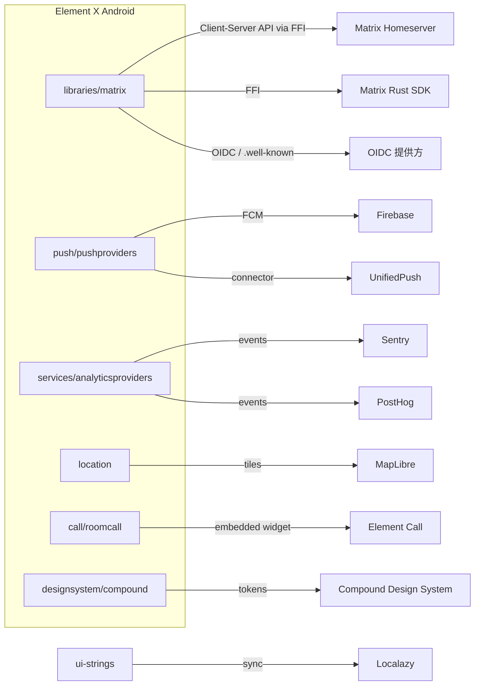

# 07 - 第三方集成关系

> 本项目与外部系统的集成关系总览。这些集成不涉及自有后端部署；应用直接与 Matrix 服务端及各类第三方 SDK 通信。

## 集成关系图

## 集成清单

| 外部系统 | 用途 | 接入点 / 依赖 |
| :--- | :--- | :--- |
| Matrix Homeserver | 消息/房间/同步（Client-Server API） | `libraries/matrix` → Rust SDK |
| Matrix Rust SDK | 会话、同步、加密、本地存储（Uniffi FFI） | `org.matrix.rustcomponents:sdk-android` |
| matrix-rust-components-kotlin | Rust SDK 的 Kotlin 分发（aar） | Maven 依赖 |
| Firebase | FCM 推送、App Distribution | `pushproviders/firebase`、Firebase BOM |
| UnifiedPush | 去中心化推送 | `pushproviders/unifiedpush` |
| Sentry | 崩溃/错误上报 | `analyticsproviders/sentry` |
| PostHog | 产品分析 | `analyticsproviders/posthog` |
| matrix-analytics-events | 标准分析事件定义 | `com.github.matrix-org:matrix-analytics-events` |
| MapLibre | 地图（位置分享） | `maplibre` 系列依赖 |
| Element Call | 内嵌语音/视频通话 | `io.element.android:element-call-embedded` |
| OIDC 提供方 | OpenID Connect 登录 | `libraries/oauth`、`libraries/wellknown` |
| rustls-platform-verifier | TLS 证书校验（Android TrustManager） | `libraries/rustls-tls` |
| Compound Design System | UI token/组件（跨 iOS 共享） | `io.element.android:compound-android` |
| Localazy | 翻译同步（与 iOS 共享字符串） | `ui-strings`（禁改 `localazy.xml`） |
| Rageshake | 崩溃反馈（内部服务） | `features/rageshake` |

## 注意事项

- 新增分析事件需遵循 `matrix-analytics-events`；新增/修改字符串经 Localazy 流程，勿直接改 `localazy.xml`。
- 升级 Rust SDK（`matrix_sdk` 版本）通常只修 API break，不随升级 PR 新增功能。
- 升级 rustls 时需检查 `rustls-platform-verifier` 版本并运行 `tools/sdk/update-rustls`。
